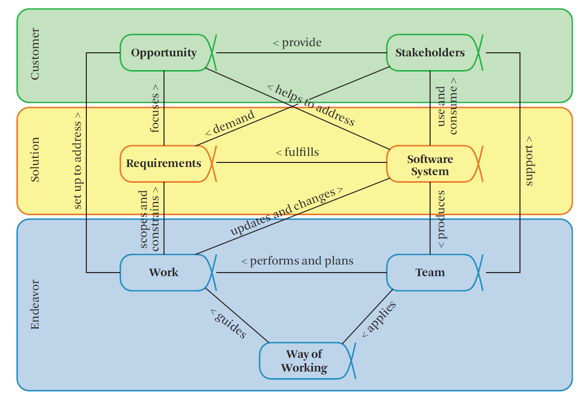
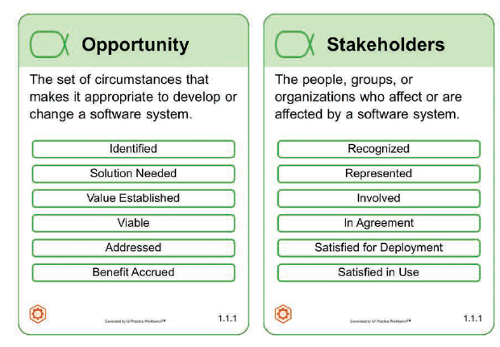

# Что такое "возможности" (opportunities) и кто такие "stakeholders"?

Стандарт Essence объединяет элементы в три отдельных *области интереса* (areas of concern) — Customer, Solution и Endeavor, каждая из которых посвящена определенному аспекту разработки ПО.

Альфы Opportunity и Stakeholders относятся к области интереса Customer (Заказчик) — в нее входит всё, что связано с фактическим использованием и эксплуатацией создаваемой программной системы.

Альфа Opportunity — Возможность. Cовокупность обстоятельств, делающих целесообразным разработку или изменение системы программного обеспечения. Возможность формулирует причину создания новой или измененной системы программного обеспечения. Она представляет собой общее понимание группы заинтересованных сторон и помогает сформировать требования к новой системе программного обеспечения, предоставляя обоснование для ее разработки.

Альфа Stakeholders — Заинтересованные стороны. Люди, группы или организации, которые влияют на систему программного обеспечения или на которые она влияет. Заинтересованные стороны предоставляют возможность и являются источником требований и финансирования для системы программного обеспечения. Члены группы также являются заинтересованными сторонами. Максимально возможное участие заинтересованных сторон на протяжении всего процесса разработки программного обеспечения важно для поддержки команды и обеспечения производства приемлемой программной системы.

Состояния альф:

# Какие возможности определены для рассматриваемой системы?

Ответ зависит от разрабатываемой системы (тут у каждого свое)

# Какие stakeholders есть для вашей системы?

Ответ зависит от разрабатываемой системы (тут у каждого свое)

# На какой стадии альфы "возможности" надо начинать "писать код"? Когда это не так?

# Может ли stakeholder быть заинтересован в отмене проекта?
Может