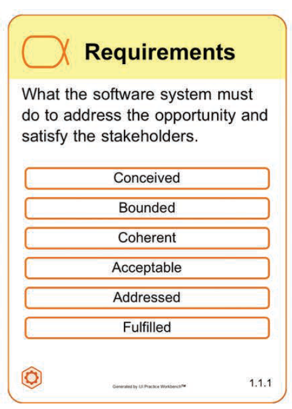
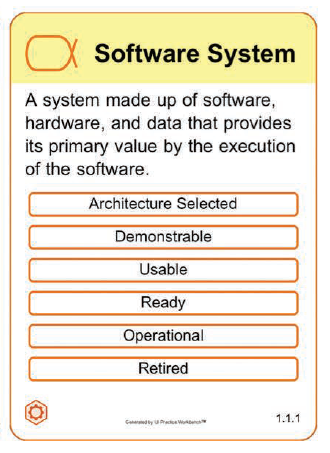
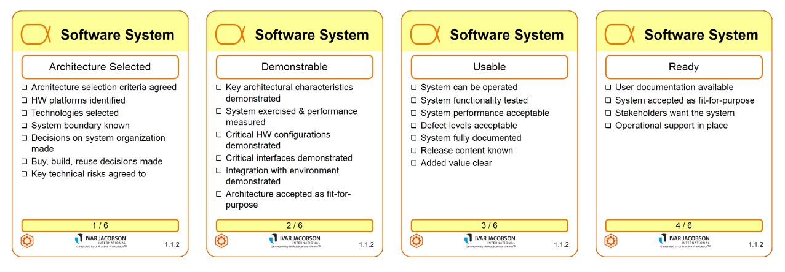
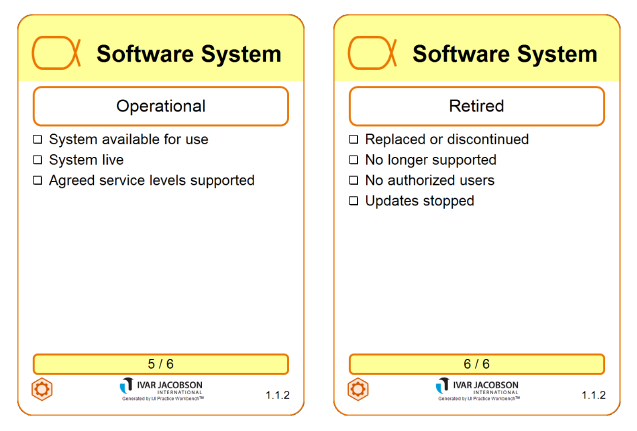

# Что такое требования?

Альфа Requirements — Требования. Это то, что должна делать система программного обеспечения, чтобы воспользоваться возможностью и удовлетворить заинтересованные стороны. Важно выяснить, что необходимо от системы программного обеспечения, поделиться этим пониманием с заинтересованными сторонами и членами команды и использовать его для разработки и тестирования новой системы.

Эта альфа входит в область интереса Solution (второй слой, желтый).

# Приведите примеры требований?

# Какие методы работы с требованиями вы знаете?

Существует целая область знаний работы с требованиями — Requirements Engineering. 

В методологии Scrum для управления требованиями используется бэклог продукта. Бэклог — это упорядоченный список всего, что может понадобиться в продукте и единственный источник требований для любого вида изменений, которые могут быть внесены в продукт. Подробнее можно прочитать в [гайде скрам](../info/2016-Scrum-Guide-Russian.pdf)

# Что такое программная система?

Альфа Software System — Программная система. Это система, состоящая из программного обеспечения, аппаратных средств и данных, которые обеспечивают ее основную ценность при выполнении программного обеспечения. Являясь основным продуктом любой разработки, программная система может быть частью более крупного программного обеспечения, аппаратного обеспечения, решения для бизнеса или социальной системы.

Эта альфа входит в область интереса Solution (второй слой, желтый).

# Что входит в состав программной системы? Почему, приведите примеры. 

Код, железо, данные для работы системы, документация системы — все первичные вещи, необходимые для ее работы и использования

# Что такое архитектура программной системы? Критерии выбора.

todo

# Расскажите и объясните отличия между стадиями альфы программной системы?

